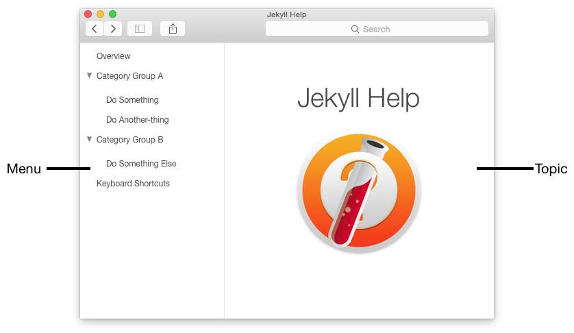

This is the Jekyll Apple Help template. This overview has some markdown samples.

## Images

## Links

- [Normal Link to topic-1, "Do Something"](topic-1.html)
- [Help anchor-link to the index page anchor, "title-page"](help:anchor=title-page+{{ site.bookid }})
- [Help openbook-link to Apple's Mac Help](help:openbook=com.apple.machelp)
- <!-- Note use of + for space. Alternatively use %20 -->
  [Help anchor-link to Safari's keyboard shortcuts](help:anchor=cpsh003+bookID=com.apple.safari.help)

## Lists

* Red
* Green
* Blue

0. Red
0. Green
0. Blue

## Inline Styles

- *Emphasis*
- **Strong**
- `inline code`

## Code

Plain Code:

    tell application "Foo"
        beep
    end tell

Jekyll Highlighted Code:


tell application "Foo"
    beep
end tell


## Blockquotes

> This is a blockquote. Lorem ipsum dolor sit amet,
> consectetuer adipiscing elit. Aliquam hendrerit mi posuere lectus.
> Vestibulum enim wisi, viverra nec, fringilla in, laoreet vitae, risus.

## Table

Column 1 Header | Column 2 Header
:--- | :---
Cell 1 | Cell 2
Cell 3 | Cell 4
